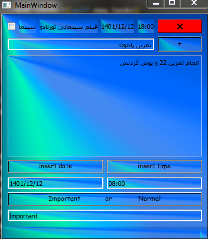
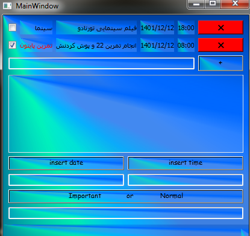

# TO DO list

for work with this application:

```
pip install pyside2
```
and
```
pip install sqlite3
```
### and run `main.py`

---
# to do list👇



and



# To convert the file to an ***EXE file***

```
pip install pyinstaller

pyinstaller main.py
```